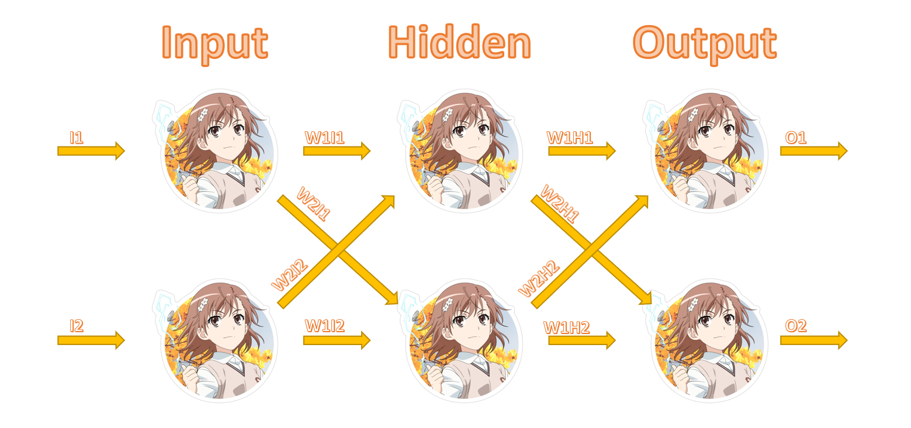

# Misaka Neural Network
Single Header C++ Neural Network library.

     
    

Misaka Neural Netwok library consists of 2 classes:
* Matrix
* NeuralNetwork

## NeuralNetwork class
### Methods:
* PUBLIC
  * `void Train(std::vector<double> pInput, std::vector<double> pTarget);`
  * `Matrix Query(std::vector<double> pInput);`
  * `void SetLearningRate(double pLearningRate);`

## Matrix class
### Methods
* PUBLIC:
  * `void Mult(double pValue);`
  * `void Mult(Matrix& pMatrix);`
  * `void Add(double pValue);`
  * `void Add(Matrix& pMatrix);`
  * `void Sub(double pValue);`
  * `void Sub(Matrix& pMatrix);`
  * `void Randomize(double min = -1, double max = 1);`
  * `void Transpose();`
  * `static Matrix Transpose(Matrix& pMatrix);`
  * `void Print();`
* PRIVATE:
  * `double GetRandomNumber(double min, double max);`

You can find more details about methods [here](include/CppNeuralNetwork.h).

## Example:
~~~~~~~~~~~.cpp
#include <MisakaNeuralNetwork.h>
int main(int argc, const char ** argv)
{
    Misaka::NeuralNetwok neuralNet(2, 2, 1);

    // Should train multiple times in random order.
    neuralNet.Train({ 0, 0 }, { 0 });
    neuralNet.Train({ 0, 1 }, { 1 });
    neuralNet.Train({ 1, 0 }, { 1 });
    neuralNet.Train({ 1, 1 }, { 0 });
    ...
    
    neuralNet.Query({ 0, 0 }).Print();  // 0.066057
    neuralNet.Query({ 0, 1 }).Print();  // 0.923139
    neuralNet.Query({ 1, 0 }).Print();  // 0.937463
    neuralNet.Query({ 1, 1 }).Print();  // 0.062518

    return 0;
}
~~~~~~~~~~~